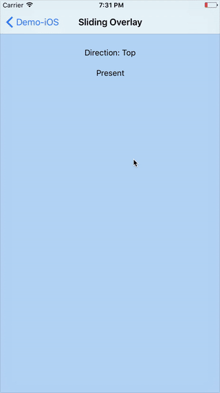

## KSOAnimation

*KSOAnimation* is a collection of custom present/dismiss transitions that extend the `UIKit` framework.

### Installation

You can install *KSOAnimation* using [cocoapods](https://cocoapods.org/), [Carthage](https://github.com/Carthage/Carthage), or as a framework. When installing as a framework, ensure you also link to [Stanley](https://github.com/Kosoku/Stanley) as *KSOAnimation* relies on it.

### Dependencies

Third party:

- [Stanley](https://github.com/Kosoku/Stanley)